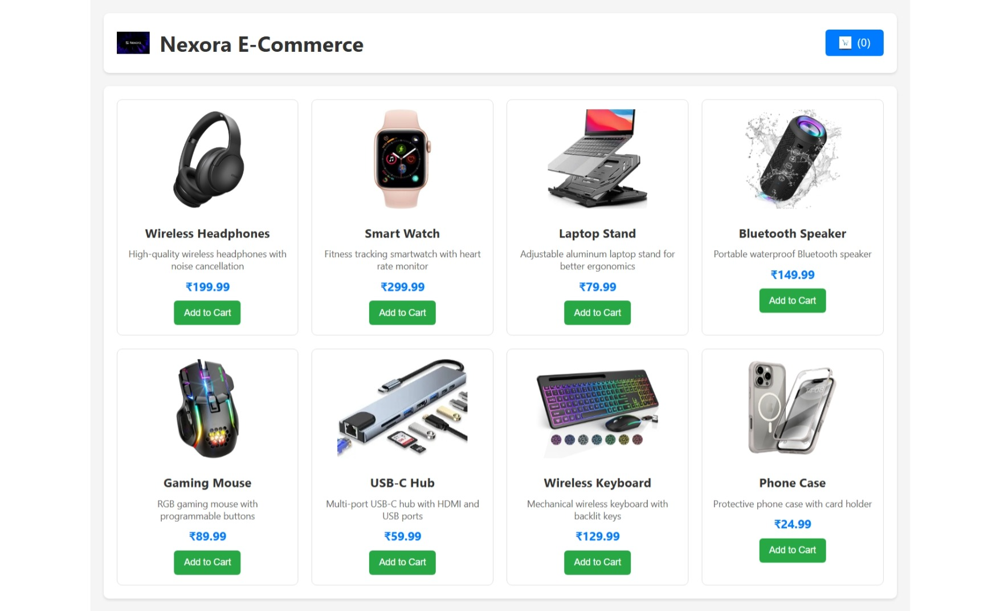
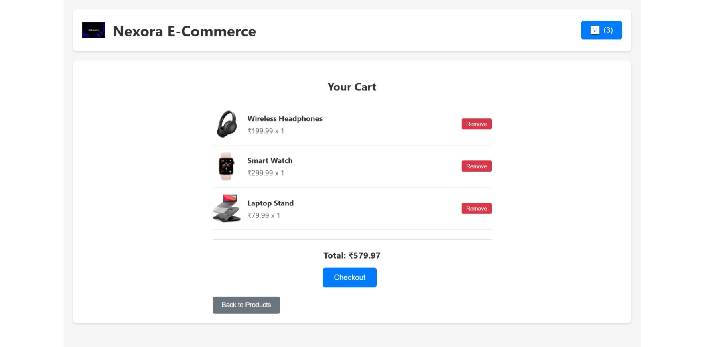
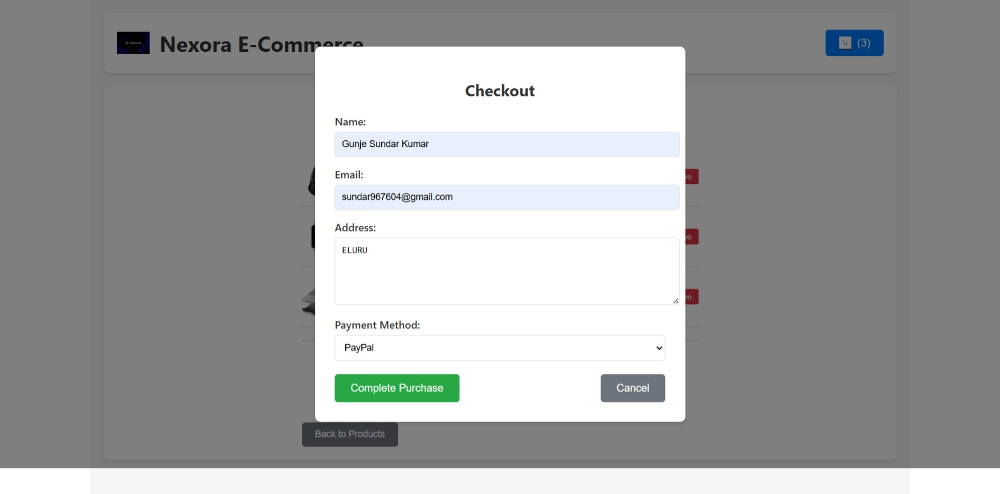
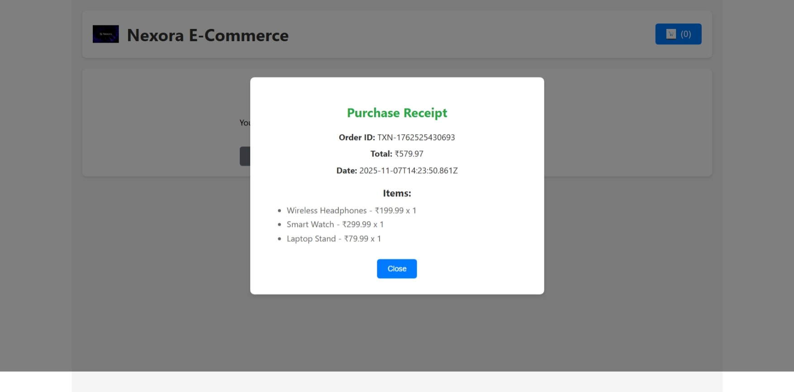
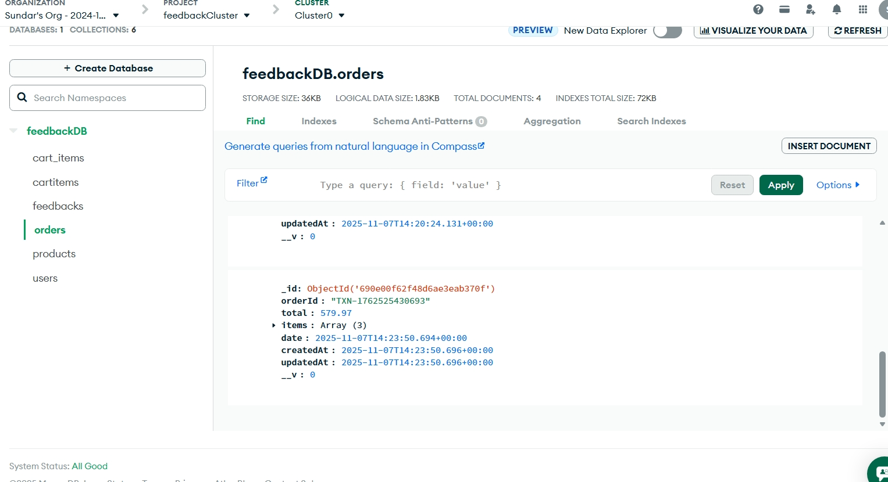

# 🛍️ Nexora E-Commerce

**Nexora E-Commerce** is a modern full-stack shopping web application built using **React.js**, **Node.js (Express)**, and **MongoDB Atlas**.  
It allows users to browse electronic gadgets, add items to the cart, proceed to checkout, and view receipts after placing an order.  
All orders are securely stored in a MongoDB database.

---

## 🚀 Features

- 🛒 Product listing with image, name, description, and price  
- ➕ Add / Remove items from the cart  
- 💳 Checkout with user details (Name, Email, Address, Payment Method)  
- 🧾 Instant purchase receipt with unique Order ID  
- ☁️ Order details stored in MongoDB  
- 🔄 Fully responsive and user-friendly UI  

---

## 🧩 Tech Stack

| Layer | Technology |
|-------|-------------|
| **Frontend** | React.js, CSS, Bootstrap |
| **Backend** | Node.js, Express.js |
| **Database** | MongoDB Atlas |
| **Authentication (Optional)** | JWT |
| **Deployment** | Netlify (Frontend) / Render / Vercel (Backend) |

---

## ⚙️ Setup Instructions

### 1. Clone the Repository
```bash
git clone https://github.com/yourusername/nexora-ecommerce.git
cd nexora-ecommerce
```

### 2. Install Dependencies

#### For Frontend:
```bash
cd client
npm install
```

#### For Backend:
```bash
cd server
npm install
```

### 3. Create a `.env` File in the Backend Folder

```env
PORT=5000
MONGODB_URI=mongodb+srv://<your_mongo_connection_string>
JWT_SECRET=mysecretkey
```

### 4. Run the Application

#### Backend:
```bash
npm start
```

#### Frontend:
```bash
npm start
```

The app will run at [http://localhost:3000](http://localhost:3000)

---

## 🖼️ Screenshots

### 🏠 Home / Products Page
Displays all available products with name, description, price, and “Add to Cart” button.  


---

### 🛍️ Cart Page
Shows added items with quantity, price, and total amount.  
Users can remove items or proceed to checkout.  


---

### 💳 Checkout Page
Collects user information and payment method.  


---

### ✅ Purchase Receipt
Displays a detailed order summary after successful checkout, including Order ID, total, date, and items.  


---

### ☁️ MongoDB Order Record
All placed orders are stored in the MongoDB `orders` collection.  
Each order includes:
- `orderId`
- `items`
- `total`
- `date`
- `createdAt` / `updatedAt`

---

### 📦 MongoDB Database Structure
The database includes the following collections:

- **products** → stores all product details  
- **cart_items / cartitems** → temporary cart data  
- **orders** → user order records  
- **users** → customer accounts (optional)  
- **feedbacks** → user feedback and ratings  


---

## 🧠 How It Works

1. User browses and adds products to the cart.  
2. Items are stored locally or in MongoDB (via Express API).  
3. On checkout, user information and cart data are sent to the backend.  
4. The backend saves the order in **MongoDB** and returns a **purchase receipt**.  
5. The frontend displays the confirmation message with all order details.  

---

## 📚 API Endpoints (Backend)

| Method | Endpoint | Description |
|--------|-----------|-------------|
| **GET** | `/api/products` | Fetch all available products |
| **POST** | `/api/cart` | Add item to cart |
| **DELETE** | `/api/cart/:id` | Remove item from cart |
| **POST** | `/api/orders` | Save new order |
| **GET** | `/api/orders` | Retrieve order history |

---

## 👨‍💻 Developer Info

**Author:** Gunje Sundar Kumar  
**Email:** [sundargunje823@gmail.com](mailto:sundargunje823@gmail.com)  
**Location:** Eluru, India  

---

## 🏁 Future Enhancements

- ✅ User authentication (SignUp / Login)  
- ✅ Admin dashboard for managing products  
- ✅ Payment gateway integration (Razorpay / Stripe)  
- ✅ Order tracking system  

---

